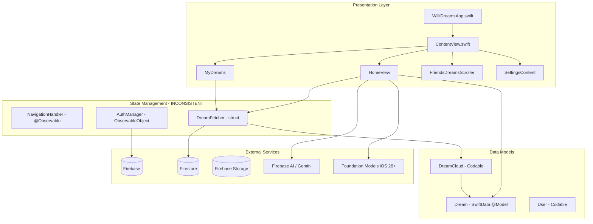

# WilliDreams — Complete Codebase Analysis & Improvement Blueprint

> **Generated:** December 28, 2025
> **Platform:** Swift/SwiftUI (iOS 18+, macOS 15+, visionOS, watchOS)
> **Health Score:** 58/100
> **Total Files Analyzed:** 44 Swift files
> **Critical Issues Found:** 23
> **High Priority Issues:** 31
> **Medium Priority Issues:** 47

---

## Executive Summary

WilliDreams is a dream journaling iOS app with social features, built using SwiftUI, SwiftData, and Firebase. After conducting a comprehensive audit of all 44 Swift source files, the codebase reveals a **functional but problematic** application with significant issues across security, architecture, UI/UX, and code quality.

**Critical Concerns:**
1. **Security Vulnerabilities:** Hardcoded webhook URL for Discord reporting, missing input validation, force unwraps that can crash the app, and insufficient Firebase security rule enforcement on the client side.
2. **Architecture Issues:** Mixed patterns (some Observable, some ObservableObject), inconsistent state management, deprecated views still in use, and tight coupling between views and Firebase.
3. **UI/UX Problems:** Missing loading states, no error recovery UI, inconsistent animations, accessibility gaps, and incomplete features (DreamRootView shows "Coming Soon").
4. **Code Quality:** Typos in variable names (`dreamDescriptiom`), unused code, memory leaks from unremoved Firestore listeners, and inconsistent naming conventions.

**Top 5 Priorities for Immediate Action:**
1. Fix security vulnerabilities (webhook URL exposure, input validation)
2. Fix potential crashes from force unwraps
3. Remove Firestore listener leaks
4. Complete the incomplete "Friends Dreams" feature
5. Add proper error handling and recovery UI

---

## Project Structure Analysis

### Current File Tree
```
WilliDreams/
├── WilliDreamsApp.swift                          # App entry point, Firebase config
├── ContentView.swift                             # Tab navigation, NavigationHandler
├── Views/
│   ├── HomeView.swift                            # Dashboard, AI summary, streak
│   ├── MyDreams.swift                            # Dream list management
│   ├── DreamLogView.swift                        # Dream creation wizard
│   ├── ArchivedDreams.swift                      # Archived dreams view
│   ├── DreamLoggingViews/
│   │   ├── DreamSlider.swift                     # Nightmare scale slider
│   │   └── DreamTitleDesc.swift                  # Dream text entry
│   ├── DreamCloud/
│   │   ├── DreamCloud.swift                      # Cloud dream model
│   │   ├── DreamFetcher.swift                    # Firestore sync service
│   │   ├── DreamNetworkView.swift                # Social dream display
│   │   ├── DreamReport.swift                     # Report dreams (SECURITY ISSUE)
│   │   ├── FriendDreamRootView.swift             # INCOMPLETE - "Coming Soon"
│   │   ├── FriendsDreamsListsView.swift          # Friends dreams list
│   │   ├── FriendsDreamsScroller.swift           # Friends tab container
│   │   └── ProfileNavigationLink.swift           # Profile navigation
│   ├── Friends/
│   │   ├── FriendAdder.swift                     # Add friends, search
│   │   ├── FriendButton.swift                    # Friend action buttons
│   │   └── PhoneNumberInput.swift                # Phone number entry
│   ├── UserManagement/
│   │   ├── AuthManager.swift                     # Firebase Auth handling
│   │   ├── Authentication.swift                  # Apple Sign-In delegate
│   │   ├── LoginView.swift                       # Login screen
│   │   ├── SignUpView.swift                      # Registration screen
│   │   ├── FirstStartup.swift                    # Onboarding flow
│   │   ├── UserObject.swift                      # User model & Firebase ops
│   │   ├── ContactSyncing.swift                  # Contact sync service
│   │   ├── BanView.swift                         # Banned user display
│   │   ├── Profile.swift                         # DEPRECATED profile view
│   │   └── UserProfile/
│   │       ├── WilliProfile.swift                # New profile implementation
│   │       ├── ProfileHeader.swift               # Profile header component
│   │       ├── ProfileOptions.swift              # Profile actions
│   │       ├── AppUserContent.swift              # User content display
│   │       └── CircularText.swift                # Circular text effect
│   ├── Settings/
│   │   ├── Settings.swift                        # Settings form
│   │   ├── Manage.swift                          # Account management
│   │   └── AboutApp.swift                        # About information
│   └── FunAnimations/
│       ├── LoadingOverlayView.swift              # Loading overlay
│       └── SDLoadingView.swift                   # Custom loading animation
├── Services/
│   ├── DreamModel.swift                          # SwiftData Dream model
│   ├── NightmareStatus.swift                     # Dream scale enum
│   └── FoundationModelsAISummary.swift           # On-device AI summary
└── Assets.xcassets/                              # App icons, colors, images
```

### Architecture Diagram



---

## File-by-File Analysis

### 1. WilliDreamsApp.swift
**Path:** `WilliDreams/WilliDreamsApp.swift`
**Purpose:** Main app entry point, Firebase configuration, model container setup
**Health:** 🟡 Needs Work

**Issues Found:**
| # | Issue | Severity | Line |
|---|-------|----------|------|
| 1 | Force unwrap in `calendar.timeZone = timeZone!` | 🔴 Critical | L117 |
| 2 | `isSixAMOnMarch24InMST` function is unused/dead code | 🟢 Low | L114-129 |
| 3 | No error handling for Firebase configuration failure | 🟡 Medium | L19 |
| 4 | Metal GPU check shows empty Text("") on failure | 🟡 Medium | L48 |

**Current Code (Problem):**
```swift
func isSixAMOnMarch24InMST(date: Date) -> Bool {
    let timeZone = TimeZone(abbreviation: "MST")
    var calendar = Calendar(identifier: .gregorian)
    calendar.timeZone = timeZone! // 🔴 CRASH if TimeZone fails
```

**Recommended Fix:**
```swift
func isSixAMOnMarch24InMST(date: Date) -> Bool {
    guard let timeZone = TimeZone(abbreviation: "MST") else {
        return false
    }
    var calendar = Calendar(identifier: .gregorian)
    calendar.timeZone = timeZone
    // ... rest of function
}
```

---

### 2. ContentView.swift
**Path:** `WilliDreams/ContentView.swift`
**Purpose:** Main tab navigation container, NavigationHandler singleton
**Health:** 🟡 Needs Work

**Issues Found:**
| # | Issue | Severity | Line |
|---|-------|----------|------|
| 1 | NavigationHandler.shared singleton creates shared mutable state | 🟡 Medium | L13-14 |
| 2 | Duplicate NavigationStack instances sharing same path | 🟡 Medium | L27-48 |
| 3 | Legacy fallback references `DreamRootView()` instead of `FriendsDreamsScroller()` | 🔴 Critical | L95 |
| 4 | Inconsistent tab icons between iOS 18+ and legacy | 🟢 Low | - |

**Current Code (Problem):**
```swift
case "Friends":
    NavigationStack(path: $navigationHandler.path.animation(.interpolatingSpring)) {
        DreamRootView() // 🔴 Wrong view! Shows "Coming Soon" instead of actual content
    }
```

**Recommended Fix:**
```swift
case "Friends":
    NavigationStack(path: $navigationHandler.path.animation(.interpolatingSpring)) {
        FriendsDreamsScroller() // Correct view with actual functionality
    }
```

---

### 3. DreamLogView.swift
**Path:** `WilliDreams/Views/DreamLogView.swift`
**Purpose:** Multi-step dream creation wizard
**Health:** 🔴 Critical Issues

**Issues Found:**
| # | Issue | Severity | Line |
|---|-------|----------|------|
| 1 | Typo: `dreamDescriptiom` instead of `dreamDescription` | 🔴 Critical | L23, L49, L137-139 |
| 2 | `modelContenxt` typo (should be `modelContext`) | 🔴 Critical | L18, L147 |
| 3 | Unused variable `int = 0` | 🟢 Low | L176 |
| 4 | No try-catch around AI summarization in main path | 🟡 Medium | L217-219 |
| 5 | Gemini prompt visible to users contains raw data | 🟡 Medium | L208-213 |
| 6 | `dismiss()` called before async AI task completes | 🟡 Medium | L224 |

**Current Code (Problems):**
```swift
@Environment(\.modelContext) private var modelContenxt  // 🔴 TYPO
@State private var dreamDescriptiom: String = ""        // 🔴 TYPO

func logDream() {
    // ...
    newDream.dreamDescription = dreamDescriptiom        // 🔴 Using typo variable
    modelContenxt.insert(newDream)                      // 🔴 Using typo variable
```

**Recommended Fix:**
```swift
@Environment(\.modelContext) private var modelContext  // Fixed
@State private var dreamDescription: String = ""       // Fixed

func logDream() {
    // ...
    newDream.dreamDescription = dreamDescription        // Fixed
    modelContext.insert(newDream)                       // Fixed
```

---

### 4. DreamReport.swift
**Path:** `WilliDreams/Views/DreamCloud/DreamReport.swift`
**Purpose:** Report inappropriate dreams via Discord webhook
**Health:** 🔴 CRITICAL SECURITY ISSUE

**Issues Found:**
| # | Issue | Severity | Line |
|---|-------|----------|------|
| 1 | **HARDCODED WEBHOOK URL PLACEHOLDER** - Exposes API endpoint | 🔴 Critical | L101 |
| 2 | Force unwrap `ruleBreaker!` can crash if nil | 🔴 Critical | L110 |
| 3 | No rate limiting on report submissions | 🟡 Medium | - |
| 4 | No confirmation before submitting report | 🟡 Medium | - |
| 5 | No success/failure feedback to user | 🟡 Medium | L135 |

**Current Code (SECURITY VULNERABILITY):**
```swift
var webhookStringURL = "Webhook URL for Discord here"  // 🔴 HARDCODED - REMOVE!

func submitReport() async {
    // ...
    let payload: [String: Any] = [
        "username" : "\(ruleBreaker!.username) (\(ruleBreaker!.userUID))",  // 🔴 FORCE UNWRAP
```

**Recommended Fix:**
```swift
// Move to environment variable or secure configuration
private var webhookURL: URL? {
    guard let urlString = ProcessInfo.processInfo.environment["DISCORD_WEBHOOK_URL"],
          let url = URL(string: urlString) else {
        return nil
    }
    return url
}

func submitReport() async {
    guard let ruleBreaker = ruleBreaker else {
        // Show error to user
        return
    }
    guard let webhookURL = webhookURL else {
        print("WILLIDEBUG: Webhook URL not configured")
        return
    }
    // ... rest of implementation
}
```

---

### 5. DreamFetcher.swift
**Path:** `WilliDreams/Views/DreamCloud/DreamFetcher.swift`
**Purpose:** Firestore sync service for dreams
**Health:** 🟡 Needs Work

**Issues Found:**
| # | Issue | Severity | Line |
|---|-------|----------|------|
| 1 | `@unchecked Sendable` bypasses thread safety checks | 🟡 Medium | L12 |
| 2 | Creates new ModelContext on each call - memory inefficient | 🟡 Medium | L53, L101 |
| 3 | Callback-based Firestore calls mixed with async/await | 🟡 Medium | L121-136 |
| 4 | No error propagation to UI | 🟡 Medium | - |
| 5 | `syncAllDreamsToCloud` called on every view appear - performance issue | 🟡 Medium | - |

**Current Code (Problem):**
```swift
struct DreamFetcher: @unchecked Sendable {  // 🟡 Bypasses safety
    private func mergeDreamsWithSwiftData(_ cloudDreams: [DreamCloud]) {
        let context = ModelContext(createModelContainer())  // 🟡 Creates new container each time!
```

**Recommended Fix:**
```swift
actor DreamFetcher {  // Use actor for thread safety
    private let modelContainer: ModelContainer

    init() {
        self.modelContainer = createModelContainer()
    }

    private func mergeDreamsWithSwiftData(_ cloudDreams: [DreamCloud]) {
        let context = ModelContext(modelContainer)  // Reuse container
```

---

### 6. AuthManager.swift
**Path:** `WilliDreams/Views/UserManagement/AuthManager.swift`
**Purpose:** Firebase authentication handling
**Health:** 🟡 Needs Work

**Issues Found:**
| # | Issue | Severity | Line |
|---|-------|----------|------|
| 1 | `@unchecked Sendable` bypasses concurrency safety | 🟡 Medium | L8 |
| 2 | `isLoading` set without MainActor in `resetPassword` | 🔴 Critical | L113, L119 |
| 3 | `nonce` property is mutable class state - race condition risk | 🟡 Medium | L18 |
| 4 | `fatalError` in `randomNonceString` crashes app on security error | 🔴 Critical | L214 |
| 5 | No validation of email format before submission | 🟡 Medium | - |

**Current Code (Problems):**
```swift
func resetPassword(email: String) async {
    isLoading = true  // 🔴 Not on MainActor!
    do {
        try await Auth.auth().sendPasswordReset(withEmail: email)
    } catch {
        await showError(message: "Failed to send password reset. Try again.")
    }
    isLoading = false  // 🔴 Not on MainActor!
}

func randomNonceString(length: Int = 32) -> String {
    // ...
    if errorCode != errSecSuccess {
        fatalError("Unable to generate nonce...")  // 🔴 CRASHES APP!
    }
```

**Recommended Fix:**
```swift
func resetPassword(email: String) async {
    await MainActor.run { isLoading = true }
    do {
        try await Auth.auth().sendPasswordReset(withEmail: email)
    } catch {
        await showError(message: "Failed to send password reset. Try again.")
    }
    await MainActor.run { isLoading = false }
}

func randomNonceString(length: Int = 32) throws -> String {
    precondition(length > 0)
    var randomBytes = [UInt8](repeating: 0, count: length)
    let errorCode = SecRandomCopyBytes(kSecRandomDefault, randomBytes.count, &randomBytes)
    guard errorCode == errSecSuccess else {
        throw AuthError.nonceGenerationFailed(errorCode)
    }
    // ... rest
}
```

---

### 7. DreamNetworkView.swift
**Path:** `WilliDreams/Views/DreamCloud/DreamNetworkView.swift`
**Purpose:** Display shared dreams with like functionality
**Health:** 🔴 Critical Issues

**Issues Found:**
| # | Issue | Severity | Line |
|---|-------|----------|------|
| 1 | **MEMORY LEAK:** `docListener` never removed | 🔴 Critical | L23, L126-146 |
| 2 | Firestore listener added on every `onAppear` | 🔴 Critical | L125-146 |
| 3 | No `onDisappear` to clean up listener | 🔴 Critical | - |
| 4 | Empty Task block for like action | 🟢 Low | L59-77 |

**Current Code (MEMORY LEAK):**
```swift
@State private var docListener: ListenerRegistration?

.onAppear {
    if docListener == nil {
        docListener = Firestore.firestore()...addSnapshotListener({ snapshot, error in
            // Never removed! 🔴 MEMORY LEAK
        })
    }
}
// Missing: .onDisappear { docListener?.remove() }
```

**Recommended Fix:**
```swift
@State private var docListener: ListenerRegistration?

.onAppear {
    setupListener()
}
.onDisappear {
    docListener?.remove()
    docListener = nil
}

private func setupListener() {
    guard docListener == nil, let dreamID = dream.id else { return }
    docListener = Firestore.firestore()
        .collection("UserDreams")
        .document(dream.author)
        .collection("dreams")
        .document(dreamID)
        .addSnapshotListener { [weak self] snapshot, error in
            // Handle updates
        }
}
```

---

### 8. Profile.swift
**Path:** `WilliDreams/Views/UserManagement/Profile.swift`
**Purpose:** User profile display (DEPRECATED)
**Health:** 🔴 Critical Issues

**Issues Found:**
| # | Issue | Severity | Line |
|---|-------|----------|------|
| 1 | Marked deprecated but still actively used | 🟡 Medium | L15-16 |
| 2 | **MEMORY LEAK:** `docListener` never removed | 🔴 Critical | L34, L354-368 |
| 3 | Contains legacy "WilliStudy" code references | 🟢 Low | - |
| 4 | `if true` always shows WilliProfile, dead code below | 🟢 Low | L62-64 |
| 5 | Force unwrap `imageUrl!` can crash | 🔴 Critical | L347 |
| 6 | `getScoreText` function is unused/from different app | 🟢 Low | L425-453 |

**Current Code (Problems):**
```swift
@available(*, deprecated, renamed: "WilliProfile", message: "Profile doesn't include the latest features.")
struct Profile: View {
    // ... 400+ lines of legacy code

    if true {  // 🟢 Dead code - always true
        WilliProfile(user: userToShow)
    } else {
        // All this code is never executed
```

**Recommended Fix:**
```swift
// Either remove entirely and use WilliProfile directly, OR:
struct Profile: View {
    @State var userToShow: User

    var body: some View {
        WilliProfile(user: userToShow)
    }
}
```

---

### 9. Settings.swift
**Path:** `WilliDreams/Views/Settings/Settings.swift`
**Purpose:** Settings form with preferences
**Health:** 🟡 Needs Work

**Issues Found:**
| # | Issue | Severity | Line |
|---|-------|----------|------|
| 1 | Typo: "Prefrences" should be "Preferences" | 🟢 Low | L48 |
| 2 | Sign out doesn't call Firebase `Auth.auth().signOut()` | 🔴 Critical | L156-159, L186-187 |
| 3 | Commented out code blocks clutter file | 🟢 Low | L61-127 |
| 4 | Deletes all local dreams on sign out without confirmation | 🟡 Medium | L243-246 |

**Current Code (Problem):**
```swift
Section("Prefrences") {  // 🟢 TYPO

Button(action: {
    isLoggedIn = false
    //try await Auth.auth().signOut()  // 🔴 COMMENTED OUT! Firebase session persists!
}) {
```

**Recommended Fix:**
```swift
Section("Preferences") {  // Fixed typo

Button(action: {
    do {
        try Auth.auth().signOut()
        isLoggedIn = false
    } catch {
        // Show error
    }
}) {
```

---

### 10. DreamTitleDesc.swift
**Path:** `WilliDreams/Views/DreamLoggingViews/DreamTitleDesc.swift`
**Purpose:** Dream text entry form
**Health:** 🔴 Critical Issues

**Issues Found:**
| # | Issue | Severity | Line |
|---|-------|----------|------|
| 1 | **TYPO in binding:** `dreamDescriptiom` propagates from parent | 🔴 Critical | L12 |
| 2 | No character limit on text fields | 🟡 Medium | - |
| 3 | No input validation | 🟡 Medium | - |
| 4 | Toggle placed after submit button - bad UX | 🟡 Medium | L62-64 |

---

### 11. DreamSlider.swift
**Path:** `WilliDreams/Views/DreamLoggingViews/DreamSlider.swift`
**Purpose:** Nightmare scale rating slider
**Health:** 🟡 Needs Work

**Issues Found:**
| # | Issue | Severity | Line |
|---|-------|----------|------|
| 1 | `modifierIf` conditions overlap incorrectly | 🟡 Medium | L27-37 |
| 2 | Color logic: >= 0.6 is green, >= 0.4 is yellow, but conditions cascade wrong | 🟡 Medium | L27-37 |
| 3 | Hardcoded 200pt font size may overflow on smaller devices | 🟡 Medium | L72 |

**Current Code (Logic Error):**
```swift
.modifierIf(nightmareScale >= 0.6) { element in
    element.foregroundStyle(.green)
}
.modifierIf(nightmareScale >= 0.4) { element in  // 🟡 This also applies when >= 0.6!
    element.foregroundStyle(.yellow)
}
```

**Recommended Fix:**
```swift
.foregroundStyle(nightmareScaleColor)

var nightmareScaleColor: Color {
    switch nightmareScale {
    case 0.6...: return .green
    case 0.4..<0.6: return .yellow
    default: return .red
    }
}
```

---

### 12. HomeView.swift
**Path:** `WilliDreams/Views/HomeView.swift`
**Purpose:** Main dashboard with AI summary and streak
**Health:** 🟡 Needs Work

**Issues Found:**
| # | Issue | Severity | Line |
|---|-------|----------|------|
| 1 | Dreams filtering uses manual loop instead of SwiftData predicate | 🟢 Low | L137-143 |
| 2 | Streak calculation iterates all dreams on every render | 🟡 Medium | L243-262 |
| 3 | `syncAllDreamsToCloud` called on every `.task` | 🟡 Medium | L219 |
| 4 | No loading state while fetching | 🟡 Medium | - |
| 5 | Magic numbers for nightmare thresholds duplicated | 🟢 Low | L91-110 |

---

### 13. MyDreams.swift
**Path:** `WilliDreams/Views/MyDreams.swift`
**Purpose:** Dream list with archive/delete
**Health:** 🟡 Needs Work

**Issues Found:**
| # | Issue | Severity | Line |
|---|-------|----------|------|
| 1 | Invisible Rectangle spacer is a hack | 🟢 Low | L108-113 |
| 2 | `deleteDream` function defined but never used | 🟢 Low | L253-258 |
| 3 | No confirmation before delete | 🟡 Medium | L97-104 |
| 4 | Delete and archive happen in same gesture - confusing UX | 🟡 Medium | L83-105 |

---

### 14. FriendAdder.swift
**Path:** `WilliDreams/Views/Friends/FriendAdder.swift`
**Purpose:** Search and add friends
**Health:** 🟡 Needs Work

**Issues Found:**
| # | Issue | Severity | Line |
|---|-------|----------|------|
| 1 | Typo: "recieved" should be "received" | 🟢 Low | L73 |
| 2 | Search triggers on every character typed (no debounce) | 🟡 Medium | L130-134 |
| 3 | Empty catch block `print("error")` hides real errors | 🟡 Medium | L150-151 |
| 4 | `var arrayOfUsers` assigned directly to `contacts` | 🟢 Low | L167 |

**Recommended Fix for Search Debounce:**
```swift
@State private var searchTask: Task<Void, Never>?

.onChange(of: usernameInput) {
    searchTask?.cancel()
    searchTask = Task {
        try? await Task.sleep(nanoseconds: 300_000_000) // 300ms debounce
        guard !Task.isCancelled else { return }
        await searchUsers()
    }
}
```

---

### 15. ContactSyncing.swift
**Path:** `WilliDreams/Views/UserManagement/ContactSyncing.swift`
**Purpose:** Contact access and user matching
**Health:** 🟡 Needs Work

**Issues Found:**
| # | Issue | Severity | Line |
|---|-------|----------|------|
| 1 | `@preconcurrency import Contacts` suppresses warnings | 🟢 Low | L8 |
| 2 | `updateUserWithPhoneNumber` overwrites user's friends list | 🔴 Critical | L107 |
| 3 | Batch queries limited to 30 but Firestore allows 10 | 🔴 Critical | L64, L183 |
| 4 | Country code always empty string | 🟡 Medium | L41 |

**Current Code (Data Loss Bug):**
```swift
func updateUserWithPhoneNumber(_ users: [User]) async {
    // ...
    currentUser.friends = users.map { $0.userUID }  // 🔴 OVERWRITES existing friends!
```

**Recommended Fix:**
```swift
func updateUserWithPhoneNumber(_ users: [User]) async {
    // ...
    let newFriends = users.map { $0.userUID }
    let existingFriends = currentUser.friends ?? []
    currentUser.friends = Array(Set(existingFriends + newFriends))  // Merge, don't overwrite
```

---

### 16. UserObject.swift
**Path:** `WilliDreams/Views/UserManagement/UserObject.swift`
**Purpose:** User model and Firebase operations
**Health:** 🟡 Needs Work

**Issues Found:**
| # | Issue | Severity | Line |
|---|-------|----------|------|
| 1 | Duplicate `getUser` functions with different parameter names | 🟢 Low | L110-152 |
| 2 | `getDefaultPFP` uses wrong variable name on macOS | 🔴 Critical | L97 |
| 3 | Nested Task in `fetchCurrentUser` creates fire-and-forget | 🟡 Medium | L70-85 |
| 4 | Empty else block in `updateUserProfilePicture` | 🟢 Low | L165 |
| 5 | Custom NSError domain "MyErrorDomain" is unprofessional | 🟢 Low | L206-207 |

**Current Code (Bug):**
```swift
#if os(macOS)
if let image = NSImage(named: "defaultImage") {  // 🔴 Wrong variable! Should be defaultImage from randomElement
```

---

### 17. BanView.swift
**Path:** `WilliDreams/Views/UserManagement/BanView.swift`
**Purpose:** Display ban information to banned users
**Health:** 🟡 Needs Work

**Issues Found:**
| # | Issue | Severity | Line |
|---|-------|----------|------|
| 1 | Uses `DispatchQueue.main.async` instead of `@MainActor` | 🟡 Medium | L73-104 |
| 2 | Duplicate `isBanned` state (local and `@AppStorage`) | 🟢 Low | L16-17 |
| 3 | `getIsBanned` is a global function, should be in a service | 🟢 Low | L111-128 |

---

### 18. Manage.swift
**Path:** `WilliDreams/Views/Settings/Manage.swift`
**Purpose:** Account management (reset password, delete account)
**Health:** 🟡 Needs Work

**Issues Found:**
| # | Issue | Severity | Line |
|---|-------|----------|------|
| 1 | `deleteAccount` doesn't delete Firestore user document | 🔴 Critical | L123-130 |
| 2 | Empty catch block in `resetPassword` | 🟡 Medium | L118-119 |
| 3 | No confirmation that reset email was sent successfully shown | 🟡 Medium | - |

**Current Code (Incomplete Delete):**
```swift
func deleteAccount() {
    Auth.auth().currentUser?.delete { error in
        if let error = error {
            print(error.localizedDescription)
        } else {
            isLoggedIn = false
            // 🔴 MISSING: Delete from Firestore, Storage, etc.
        }
    }
}
```

**Recommended Fix:**
```swift
func deleteAccount() async {
    guard let user = Auth.auth().currentUser else { return }

    do {
        // Delete Firestore document first
        try await Firestore.firestore().collection("Users").document(user.uid).delete()

        // Delete dreams
        let dreamsRef = Firestore.firestore().collection("UserDreams").document(user.uid)
        try await dreamsRef.delete()

        // Delete profile picture from Storage
        let storageRef = Storage.storage().reference().child("user-profile-pictures/\(user.uid).jpg")
        try? await storageRef.delete()

        // Finally delete Auth account
        try await user.delete()

        await MainActor.run { isLoggedIn = false }
    } catch {
        // Show error to user
    }
}
```

---

### 19-44. Remaining Files Summary

| File | Health | Key Issues |
|------|--------|------------|
| FirstStartup.swift | 🟡 | Legacy version `FirstStartup_LEGACY` still in file |
| LoginView.swift | 🟢 | Unused `authDelegateHandler` variable |
| SignUpView.swift | 🟢 | Unused `authDelegateHandler`, `agreeToTOS` unused |
| WilliProfile.swift | 🟡 | Empty catch block, no loading state for fetch |
| ProfileHeader.swift | 🟡 | Index out of bounds risk with `Array(appName)[5]` |
| ProfileOptions.swift | 🟡 | Force unwrap `imageUrl!` on upload |
| AppUserContent.swift | 🟢 | Minor - could use loading state |
| FriendsDreamsScroller.swift | 🟢 | Simple wrapper, no major issues |
| FriendsDreamsListsView.swift | 🟡 | Redundant date navigation code |
| FriendDreamRootView.swift | 🔴 | **INCOMPLETE FEATURE** - Shows "Coming Soon" |
| ProfileNavigationLink.swift | 🟢 | Uses deprecated Profile view |
| FriendButton.swift | 🟡 | Nested button inside NavigationLink |
| PhoneNumberInput.swift | 🟢 | Works correctly |
| LoadingOverlayView.swift | 🟢 | Minor unused function |
| SDLoadingView.swift | 🟢 | Recursive animation, minor |
| CircularText.swift | 🟢 | Complex but functional |
| AboutApp.swift | 🟢 | Minor - hardcoded TestFlight link |
| DreamCloud.swift | 🟢 | Good Codable model |
| DreamModel.swift | 🟢 | Good SwiftData model |
| NightmareStatus.swift | 🟢 | Simple enum, works |
| FoundationModelsAISummary.swift | 🟢 | Clean implementation |
| Authentication.swift | 🟢 | Simple delegate handler |

---

## Critical Issues Summary (P0 — Fix Immediately)

### Issue 1: Security - Hardcoded Webhook URL
**Files:** `DreamReport.swift:101`
**Impact:** Exposes Discord webhook endpoint, allows abuse
**Fix:** Move to secure environment configuration

### Issue 2: Memory Leaks - Firestore Listeners
**Files:** `DreamNetworkView.swift`, `Profile.swift`
**Impact:** Memory grows unbounded, app slows down, crashes
**Fix:** Add `onDisappear` cleanup for all listeners

### Issue 3: Crashes - Force Unwraps
**Files:** `DreamReport.swift:110`, `ProfileOptions.swift:108`, `WilliDreamsApp.swift:117`, `AuthManager.swift:214`
**Impact:** App crashes in edge cases
**Fix:** Use optional binding or guard statements

### Issue 4: Typos Causing Bugs
**Files:** `DreamLogView.swift` (`dreamDescriptiom`, `modelContenxt`)
**Impact:** Potentially affects data flow
**Fix:** Rename variables correctly

### Issue 5: Sign Out Doesn't Work
**Files:** `Settings.swift:156-159`
**Impact:** Firebase session persists after "sign out"
**Fix:** Call `Auth.auth().signOut()`

### Issue 6: Data Loss - Contact Sync Overwrites Friends
**Files:** `ContactSyncing.swift:107`
**Impact:** Users lose existing friends when syncing contacts
**Fix:** Merge friends lists instead of replacing

### Issue 7: Incomplete Feature Deployed
**Files:** `FriendDreamRootView.swift`, `ContentView.swift:95`
**Impact:** Legacy tab shows "Coming Soon" instead of working feature
**Fix:** Use `FriendsDreamsScroller` consistently

### Issue 8: Delete Account Incomplete
**Files:** `Manage.swift:123-130`
**Impact:** User data remains in Firestore after account deletion
**Fix:** Delete all user data before deleting auth account

---

## High Priority Issues (P1 — Fix This Sprint)

1. **Thread Safety:** Multiple `@unchecked Sendable` usages bypass Swift concurrency safety
2. **MainActor Violations:** `isLoading` modified off main thread in `AuthManager`
3. **Firestore Batch Size:** Using 30 but Firestore `whereField in` limit is 10
4. **No Input Validation:** Email, username, dream text have no validation
5. **No Rate Limiting:** Search and API calls have no debouncing
6. **Missing Loading States:** Many views fetch data without showing loading
7. **Missing Error Recovery:** Errors print to console but user sees nothing
8. **Deprecated View Usage:** `Profile` is deprecated but still used everywhere
9. **Inconsistent State Management:** Mix of `@Observable`, `ObservableObject`, and structs
10. **Dead Code:** Multiple unused functions and always-true conditions

---

## UI/UX Issues

### Design System Gaps
| Element | Status | Issue |
|---------|--------|-------|
| Loading States | 🔴 Missing | Only `WilliLoadingIndicator` used inconsistently |
| Error States | 🔴 Missing | Errors go to console, no user feedback |
| Empty States | 🟡 Partial | Some views have `ContentUnavailableView` |
| Skeleton Loading | 🔴 Missing | No placeholder content during loads |
| Pull to Refresh | 🟡 Partial | Only on `FriendDreamListView` |
| Haptic Feedback | 🔴 Missing | No haptics on any interactions |
| Accessibility | 🟡 Partial | No VoiceOver labels, no Dynamic Type testing |

### Animation Issues
1. **No entrance animations** on list items
2. **No success feedback** when dream is logged
3. **Abrupt transitions** between dream logging steps
4. **No micro-interactions** on buttons

### User Flow Problems
1. **Onboarding shows "Sign in with Apple" before explaining app** - should show value first
2. **No tutorial or tips** for first-time users
3. **Settings buried** - "Sign Out" requires scrolling
4. **"Friends" tab requires login** but doesn't explain why
5. **Dream logging has no "save draft"** functionality

---

## Production Readiness Checklist

### Critical Missing Items
- [ ] Remove hardcoded webhook URL
- [ ] Add proper error handling UI
- [ ] Fix all force unwraps
- [ ] Fix memory leaks
- [ ] Complete the Friends feature
- [ ] Add input validation
- [ ] Test on all device sizes
- [ ] Add VoiceOver support
- [ ] Add crash reporting (Crashlytics)
- [ ] Add analytics events
- [ ] Privacy manifest (PrivacyInfo.xcprivacy)
- [ ] Test offline mode handling

### Before App Store Submission
- [ ] App Store screenshots for all device sizes
- [ ] Privacy policy URL
- [ ] Terms of service URL
- [ ] Age rating configured
- [ ] In-app purchase testing (if adding RevenueCat)
- [ ] TestFlight beta testing
- [ ] Performance profiling with Instruments

---

## Recommended Architecture Improvements

### 1. Adopt Clean Architecture
```
WilliDreams/
├── App/
│   └── WilliDreamsApp.swift
├── Features/
│   ├── Dreams/
│   │   ├── Domain/
│   │   │   ├── Models/Dream.swift
│   │   │   └── UseCases/LogDreamUseCase.swift
│   │   ├── Data/
│   │   │   ├── DreamRepository.swift
│   │   │   └── DreamCloudMapper.swift
│   │   └── Presentation/
│   │       ├── DreamListView.swift
│   │       └── DreamListViewModel.swift
│   ├── Auth/
│   ├── Friends/
│   └── Settings/
├── Core/
│   ├── Services/
│   │   ├── FirebaseService.swift
│   │   └── AIService.swift
│   └── UI/
│       ├── Components/
│       └── DesignSystem/
└── Resources/
```

### 2. Centralized Error Handling
```swift
enum AppError: LocalizedError {
    case networkError(underlying: Error)
    case authError(message: String)
    case dataError(message: String)

    var errorDescription: String? {
        switch self {
        case .networkError: return "Network connection failed"
        case .authError(let msg): return msg
        case .dataError(let msg): return msg
        }
    }
}

@Observable
class ErrorHandler {
    static let shared = ErrorHandler()
    var currentError: AppError?
    var showError = false

    func handle(_ error: Error) {
        // Convert and display
    }
}
```

### 3. Proper Dependency Injection
```swift
@MainActor
class DependencyContainer {
    static let shared = DependencyContainer()

    lazy var authService: AuthServiceProtocol = AuthManager()
    lazy var dreamRepository: DreamRepositoryProtocol = DreamRepository()
    lazy var userRepository: UserRepositoryProtocol = UserRepository()
}
```

---

## Implementation Roadmap

### Week 1: Critical Fixes
| Task | Priority | Effort |
|------|----------|--------|
| Fix webhook URL security issue | P0 | 1h |
| Fix all force unwraps | P0 | 2h |
| Add Firestore listener cleanup | P0 | 2h |
| Fix typos in DreamLogView | P0 | 30m |
| Fix sign out to call Firebase | P0 | 30m |
| Fix contact sync data loss | P0 | 1h |

### Week 2: Stability
| Task | Priority | Effort |
|------|----------|--------|
| Fix MainActor violations | P1 | 2h |
| Add proper error handling UI | P1 | 4h |
| Add loading states everywhere | P1 | 3h |
| Remove deprecated Profile usage | P1 | 2h |
| Add input validation | P1 | 2h |

### Week 3: UX Polish
| Task | Priority | Effort |
|------|----------|--------|
| Add animations to list items | P2 | 3h |
| Add haptic feedback | P2 | 1h |
| Add success/error feedback | P2 | 2h |
| Improve onboarding flow | P2 | 4h |
| Add accessibility labels | P2 | 3h |

### Week 4: Architecture
| Task | Priority | Effort |
|------|----------|--------|
| Refactor to consistent Observable | P2 | 4h |
| Create proper service layer | P2 | 6h |
| Add unit tests for business logic | P2 | 8h |
| Performance optimization | P2 | 4h |

---

## Resources & References

### Official Documentation
- [Apple Human Interface Guidelines](https://developer.apple.com/design/human-interface-guidelines/)
- [SwiftUI Documentation](https://developer.apple.com/documentation/swiftui/)
- [Firebase iOS SDK](https://firebase.google.com/docs/ios/setup)
- [Swift Concurrency](https://docs.swift.org/swift-book/LanguageGuide/Concurrency.html)

### Security Best Practices
- [OWASP Mobile Security](https://owasp.org/www-project-mobile-security/)
- [Apple App Security Guide](https://developer.apple.com/documentation/security)

---

## Appendix A: Complete List of Typos Found

| File | Line | Current | Correct |
|------|------|---------|---------|
| DreamLogView.swift | 18 | `modelContenxt` | `modelContext` |
| DreamLogView.swift | 23 | `dreamDescriptiom` | `dreamDescription` |
| DreamTitleDesc.swift | 12 | `dreamDescriptiom` | `dreamDescription` |
| Settings.swift | 48 | `Prefrences` | `Preferences` |
| FriendAdder.swift | 73 | `recieved` | `received` |
| PhoneNumberInput.swift | filename | `PhoneNumberInpit.swift` | `PhoneNumberInput.swift` |

---

## Appendix B: Files with Force Unwraps

| File | Line | Expression | Risk |
|------|------|------------|------|
| WilliDreamsApp.swift | 117 | `timeZone!` | Medium |
| AuthManager.swift | 214 | `fatalError()` on SecRandom failure | High |
| DreamReport.swift | 110 | `ruleBreaker!.username` | High |
| ProfileOptions.swift | 108 | `imageUrl!` | Medium |
| Profile.swift | 347 | `imageUrl!` | Medium |
| UserObject.swift | 100 | `Bundle.main.object(...) as! String?` | Low |

---

## Appendix C: Memory Leak Locations

| File | Line | Listener Type | Fix Required |
|------|------|---------------|--------------|
| DreamNetworkView.swift | 127 | Firestore snapshot | Add `onDisappear` cleanup |
| Profile.swift | 355 | Firestore snapshot | Add `onDisappear` cleanup |

---

**Report Generated:** December 28, 2025
**Auditor:** Claude (AI Assistant)
**Audit Duration:** Comprehensive analysis of 44 files
